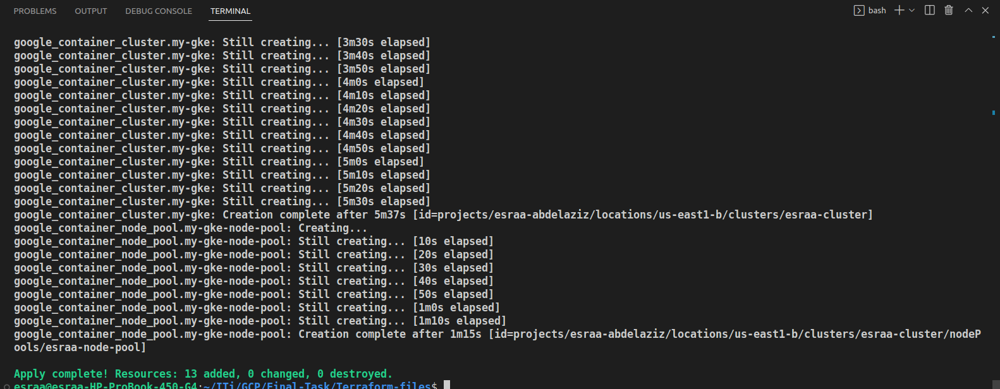
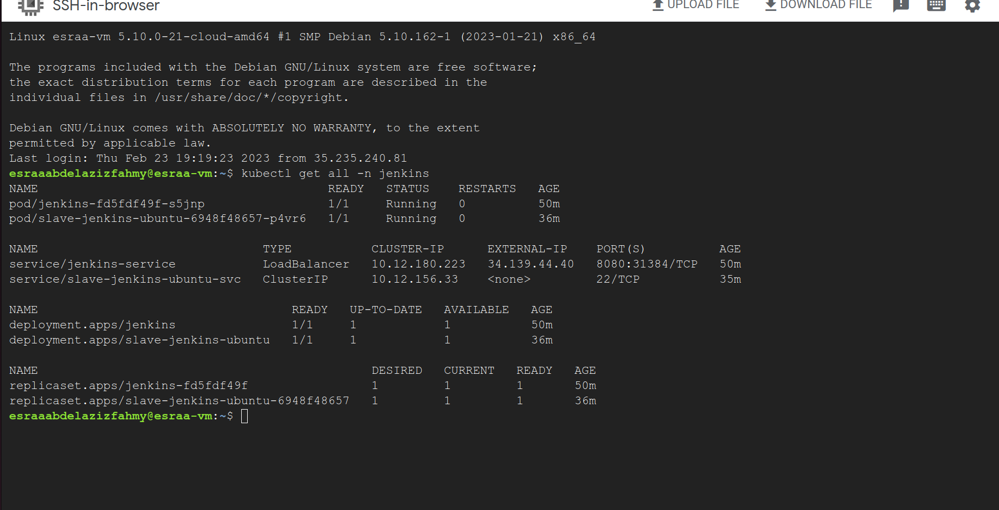

# Infra-Repo

create a cluster and deploy jenkins and deploy a app in it in gcp

Deploy an application on GKE using CI/CD Jenkins Pipeline using the following steps:

1- Implement a secure GKE Cluster

2- Deploy and configure Jenkins on GKE

3- Deploy the backend application on GKE using the Jenkins pipeline

# First-Part

1-Install Terraform and create Infrastructure.

-  Infrastructure Overview
    
      1-vpc.

      2-Two subnets [management subnet and restricted subnet],NAT Gateway for two subnets and Firewall to allow SSH Connection.

      3-GKE Files Consist of:

        private container cluster resource with authorized networks configuration - node pool with count 1.

      4- a Private VM to Connect with GKE Cluster.
    
    
2-Build Infrastructure. [3 steps ]

 -Initialize Terraform use
  
    terraform init
         
 -Check Plan
 
    terraform init
    
 -Apply the plan
 
    terraform apply
    
 -screenshot of terraform init:
  
  
  
  -screenshot of terraform plan:
  
  
  
  
  
  -screenshot of terraform apply:
  
  
  
  
  
3-Check Infrastructure using console. 
 -vpc
 
  
 
 -vm
  
   
   
 -two subnets
   
   
   
 -cluster
  
   
   
   
   
4- SSH VM

5-Connect to Private GKE Cluster through VM 

   
   
6-Install kubectl and GKE gcloud auth Plugin

    sudo apt-get install kubectl
    
    sudo apt-get install google-cloud-sdk-gke-gcloud-auth-plugin

7-Log in with your Credentials

    gcloud auth login

8- Set your active Application Default Credentials

    gcloud auth application-default login
    
 -Then build my-image and push it to gcr to use it in slave-pod  
    
   
    
   
    
   
    
   
    
9-Deploy jenkins on GKE Cluster
    
    kubectl apply -f jenkins.yml 

    kubectl apply -f jenkins_Service.yml
    
    kubectl apply -f ServiceAccount.yml

    kubectl apply -f slave-deploy.yaml

    kubectl apply -f slave-svc.yaml 

    kubectl apply -f volumes.yml

10- View all pods in  jenkins namespace
   
    kubectl get all -n jenkins
    
  - screen of all in jenkins namespace 
  
   
   
11-Get a EXTERNAL-IP

   

12-Use EXTERNAL-IP and acces Jenkins 

   -Link of Jenkins:  http://34.139.44.40:8080
  
  
  
 

# Second-Part

    Build CI/CD Pipeline using Jenkins 
    
Jenkins will do these things:

  - Build an image from Dockerfile

  - Push the image to DockerHub

  - Apply deployment for the app based on the image
 
  - Apply LoadBalancer service for the app

The Steps:

1- Create new node slave node and create credentials for it.

   
   
 - Create credentials for slave node 
 
   

 - Configuration of the salve node
 
   
   
 - SSH slave node and change passwd
 
   
 
 - Connect to Cluster from through slave node 
 
   
 
 - Finally node successfully connected and online 
 
   
   
 - Jenkins page after create slave node
 
   

2- Create CI-CD Pipeline and The Pipeline will do.

 - Pull Code from GitHub

 - Build the Application image using Docker

 - Push Image to DockerHub

 - Trigger CD Pipeline to Run

 - Deploy our Application in GKE
 
The Steps:

 - Create name space for app application
  
  
  
 - Create pipeline and add credential for it [Dockerhub Account]
 
  
  
  
  
 - Build and Deploy
  
  
  
  
   
 - Get Services and Ingress 
 
  

 - Push image hello-world to Dockerhub Repository  
  
  

 - Get IP and Access My App Page 
 
  

 - Finally Open My page  
 
  

 - Link To My Page : 
  
   http://35.231.6.0
   

